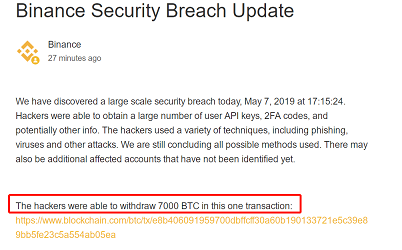
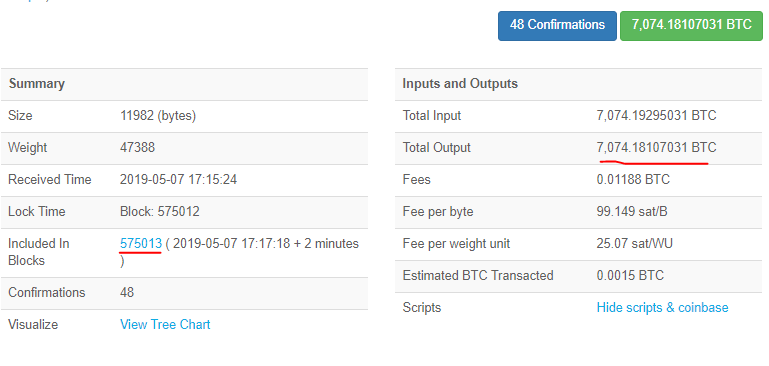
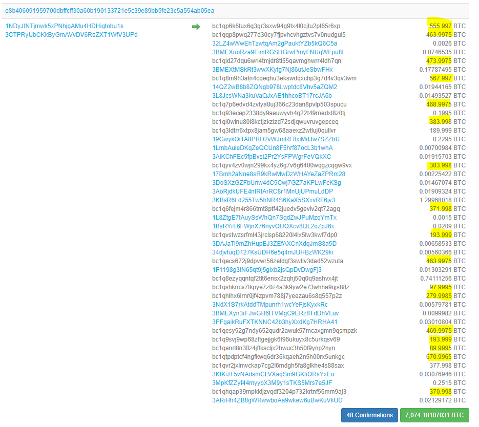
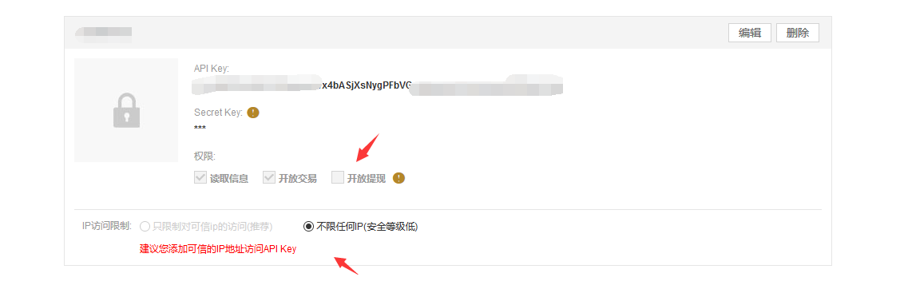
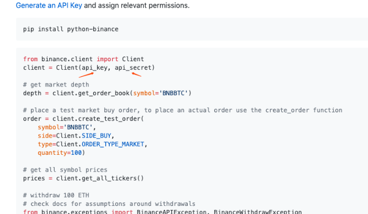

# 7000比特币的损失，币安热钱包被盗事件分析

 

5月8日早晨，币安官方发出公告称于2019年5月7日17:15:24（UTC）在系统中发现“大规模安全漏洞”。

 

币安表示该安全漏洞是黑客使用了复合型技术，包括网络钓鱼、病毒等其他攻击手段，从而黑客能够访问大量用户应用程序接口密钥（API keys）、双因素身份验证码（2FA码）、以及其他信息，在区块高度575012处从币安热钱包中盗取7000枚比特币。致使交易所损失4100万美金。

 

针对此次盗币事件，Beosin成都链安秉持打造区块链全生态安全的宗旨，我们的技术团队第一时间采取行动，作出深度分析。

 

## 攻击现场：

 

黑客攻击交易详情如下，

攻击最后发生在575013块，总损失最高可达7074个BTC。

 

下图为黑客详细提币地址：（黄色标记部分为主要提币地址）

 

截至目前，币安热钱包（地址：1NDyJtNTjmwk5xPNhjgAMu4HDHigtobu1s）被盗约7000枚BTC。

 

现在币安的热钱包余额3,612.69114593个BTC，有余额留存，说明币安热钱包的私钥目前是安全的。

 

## 事件分析：

 

经过我们分析，在5月8日 01：17：18 （北京时间）通过API接口在同一时间发起提币操作。

 

币安交易所的API申请后会生成API key和Secret key，如下图：

 

API接口有“限定用户开放IP限制”和“开放提现的功能”。

 

“开放提现”是指直接利用 API key和Secret key直接提现，不需要手机验证码、短信、谷歌验证码。

 

如下图：

 

API部分官方调用代码demo如下：

（来自https://github.com/binance-exchange/python-binance）

我们初步分析认为是用户的API key和Secret key信息泄露导致的此次攻击。

 

如果用户没有限制ip并配置了开放提现功能，任意攻击者在获取了API key和Secret key信息后便可以实现攻击。

 

用户的信息泄露途径可能有四：

1.普通用户一般不会使用API key，一般是高级用户用于代码中实现自动化交易，可能是用户源码泄露导致 Secret key泄露 

2.用户被钓鱼攻击，输入了API key和Secret key被黑客截取。

3.用户的API key和Secret key保存的电脑被攻击窃取。

4.币安交易所系统原因导致用户API key和Secret key泄露，其中只有71个用户开放了提现功能，被盗币。

 

## 安全提示：

 

Beosin 成都链安建议各交易所和用户都应该注意信息的保护，用户在使用开放提现等高级功能时，应提高对安全性的重视，避免信息泄露导致的各种危害，不让攻击者有可乘之机。

 

 

 
