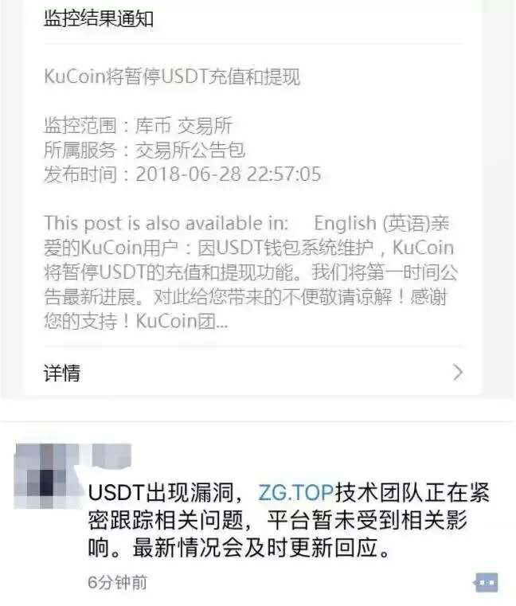
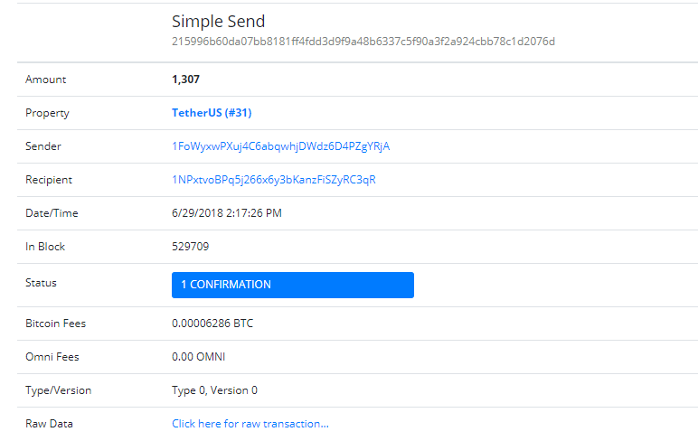
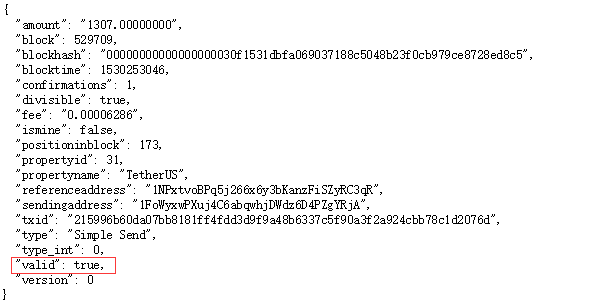

有安全公司突然发表言论：**提醒各大交易所尽快暂停 USDT 充值功能，并自查代码是否存在逻辑缺陷。**

随后各大交易所相继暂停USDT的充提：

火币、OKex等大平台开启自查，并于晚间发布了相关信息：

该安全公司报道，交易所在进行USDT充值交易是否成功时存在逻辑缺陷，未校验区块链上交易详情中valid字段是否为true，导致“假充值”，用户未损失任何USDT却成功向交易所充值USDT代币，而且这些USDT可以正常使用。

**那么什么是USDT？**

USDT的发行和交易使用的是Omni（原Mastercoin）协议，它是一个基于比特币区块链的2.0币种。USDT的交易确认等参数与比特币是一致的。

用户可以通过SWIFT电汇美元至Tether公司提供的银行帐户，或通过交易所换取USDT。赎回美元时，反向操作即可。用户也可在交易所用比特币换取USDT。Tether公司严格遵守1：1的准备金保证，即每发行1枚USDT代币，其银行帐户都会有1美元的资金保障。用户可以在Tether平台进行资金查询，以保障透明度。

**对交易所有什么影响？**

USDT因为其价值不受市场因素波动，固定锚定兑换美元，交易所常以它作为平台的基准币（法币），用户也可以在币圈预计低潮的时候，将其它代币转换为USDT，作保值处理。

**漏洞分析**

经过我们分析，此次漏洞是因为，**交易所可能没有对用户USDT充值交易进行确认，导致用户可能“假充值”，根本原因是再进行区块链Dapp开发时，对区块链接口开发理解不充分、没有做好严格安全把控。**

链安科技专注区块链智能合约安全，但是安全无小事，无论是区块链智能合约安全，还是区块链平台接口使用安全，或者平台本身的安全都非常重要。我们目前重点关注区块链智能合约的安全，未来不排除开展更多的区块链安全方面的服务，让区块链生态更安全。